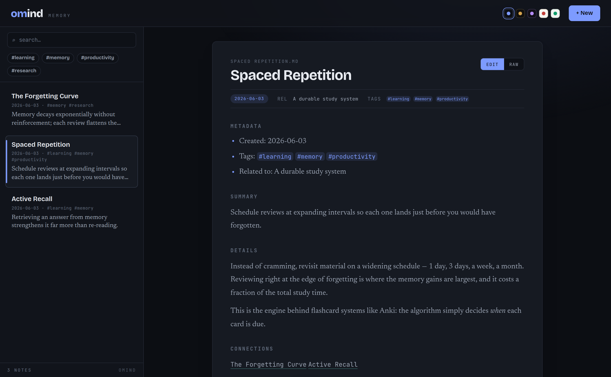

# omind

OMI/Obsidian memory tooling for AI agents: reproduce the integration on any machine, plus a local web app to view, edit, and add memory entries.

[](https://github.com/CryptoJones/omind/actions/workflows/test.yml)
[](LICENSE)
[](https://codeberg.org/CryptoJones/omind)
[](https://github.com/CryptoJones/omind)
[](https://www.python.org/)
[]()

> Mirrored on both [GitHub](https://github.com/CryptoJones/omind) and
> [Codeberg](https://codeberg.org/CryptoJones/omind). Issues filed on
> either are welcome; commits are pushed to both.

---



*The `omind serve` web UI viewing a memory note in the Midnight theme — one of five built-in themes.*

## What it does

**OMI** ("Open Mind Interface") is a folder of Markdown notes that an AI agent
reads and writes as long-term memory. `omind` does two things with it:

- **`omind setup`** — idempotently provisions the
  [`obsidian-mcp`](https://www.npmjs.com/package/obsidian-mcp) server for the
  Claude Code CLI, pointed at an OMI folder inside an Obsidian vault. After this,
  Claude Code can persist memory across sessions through the MCP tools.
- **`omind serve`** — a small local web app (FastAPI + Tailwind) to **view, edit,
  and add** memory entries in that same folder, without opening Obsidian. Ships
  with five themes and a switchable UI in six languages (English, Spanish,
  French, Arabic, Russian, Chinese), including right-to-left layout for Arabic.
- **`omind doctor`** — diagnose the wiring in one shot: Node/npm/Claude CLI on
  `PATH`, the MCP server registered at user scope (in the leak-free direct-`node`
  form) and pointed at the right folder, the stdin-EOF guard in place, and the
  OMI folder + Obsidian config readable.

The web UI works **fully offline** (fonts, styles, and the Markdown renderer are
vendored — no CDN). It shows **backlinks** for the open note, refreshes the list
live as other tools write the folder, guards against clobbering external edits,
and has keyboard shortcuts (`/` search, `n` new, `j`/`k` to move, `Ctrl`/`Cmd`+`S`
to save, `Esc` to cancel).

Everything runs locally. No accounts, no cloud, no cost.

## Install

**One-step bootstrap** (checks/installs dependencies, installs omind, verifies):

```bash
# clone, then:
scripts/bootstrap.sh                       # or: --remote codeberg, --vault PATH
```

It auto-installs `uv` (user-local, no root — and it bootstraps Python ≥3.10 for
you), checks for `node`/`npm`/`claude` with install guidance if any are missing,
then runs `omind setup` + `omind doctor`. Note: omind has **no Docker
dependency** — only Node.js and the Claude Code CLI.

**Manual** — an isolated CLI install straight from the git remote:

```bash
# via uv (recommended — also provides a compatible Python if the system one is <3.10)
uv tool install git+https://github.com/CryptoJones/omind.git

# or via pipx
pipx install git+https://github.com/CryptoJones/omind.git
```

Either puts the `omind` command on your `PATH` in its own virtualenv. Codeberg
works too — swap in `git+https://codeberg.org/CryptoJones/omind.git`.

For development, install editable from a clone (see [CONTRIBUTING.md](CONTRIBUTING.md)):

```bash
git clone https://github.com/CryptoJones/omind.git
cd omind
pip install -e ".[dev]"
```

## Quick start

Provision the Claude Code MCP wiring (idempotent; safe to re-run):

```bash
omind setup --vault "$HOME/Documents/Obsidian Vault"
```

Prefer to wire things in yourself? Print the same steps as copy-paste shell
commands and JSON, personalized to your paths — nothing is changed for you:

```bash
omind quickstart --vault "$HOME/Documents/Obsidian Vault"
```

It covers all four pieces (memory folder scaffold, MCP server install + stdin-EOF
guard, user-scope registration, auto-memory hooks), each independently
applicable. The annotated walkthrough lives in
[docs/manual-setup.md](docs/manual-setup.md).

Run the web UI over the same memory folder:

```bash
omind serve --vault "$HOME/Documents/Obsidian Vault"
# open http://127.0.0.1:8765
```

Preview what setup *would* do without changing anything:

```bash
omind setup --vault "$HOME/Documents/Obsidian Vault" --dry-run
```

Check that everything is wired up correctly:

```bash
omind doctor --vault "$HOME/Documents/Obsidian Vault"
```

Add or update a single memory note safely — it creates the note, or updates it
in place if the title already exists, through the same locked, atomic write path
every other tool uses (body comes from stdin):

```bash
echo "the body of the note" | omind note --title "An Insight" --tags thesis,attention
```

Back up or migrate the whole memory dataset:

```bash
# export — json (default; portable & diffable) or targz (full-fidelity snapshot)
omind export --vault "$HOME/Documents/Obsidian Vault" --out omi-export.json
omind export --vault "$HOME/Documents/Obsidian Vault" --format targz --out omi.tar.gz

# import — format auto-detected by extension
omind import omi-export.json --vault "$HOME/Documents/Obsidian Vault"
```

Import adds new notes and leaves identical ones untouched; a note whose content
differs is kept as-is on disk and reported, unless you pass `--force`. Imports
never delete.

## Other agents: Hermes Agent and OpenClaw

Claude Code is the default, but the same OMI folder can back any agent. `omind
setup --agent ...` provisions two more out of the box:

```bash
omind setup --agent hermes   --vault "$HOME/Documents/Obsidian Vault"   # Hermes Agent
omind setup --agent openclaw --vault "$HOME/Documents/Obsidian Vault"   # OpenClaw
```

Each does the same three things, adjusted for where that agent keeps its
config:

1. The shared steps — OMI folder scaffold, `obsidian-mcp` install, stdin-EOF
   guard — identical to the Claude Code path, so all agents talk to **one**
   memory folder through one server install.
2. Registers the MCP server where the agent looks for it: the `mcp_servers`
   block in `~/.hermes/config.yaml` (Hermes Agent), or the `mcp.servers` block
   in `~/.openclaw/openclaw.json` (OpenClaw — legacy `~/.clawdbot` /
   `~/.moltbot` installs are detected too). Only omind's own entry is ever
   touched; a config file that doesn't parse is never overwritten.
3. Installs an `omind-omi-memory` skill into the agent's skills directory that
   teaches it to **read** memory through the MCP tools and **write** it through
   `omind note` — the single-writer path that keeps concurrently running
   agents from corrupting the folder (see
   [docs/mesh.md](docs/mesh.md) → "Node types & the single-writer rule").

`omind doctor --agent hermes|openclaw` diagnoses that agent's wiring, and
`omind quickstart --agent hermes|openclaw` prints the manual steps (YAML/JSON
snippets personalized to your paths) if you'd rather merge them in yourself.

The auto-memory journal hooks remain Claude Code-only for now — Hermes Agent
and OpenClaw emit different hook payloads; their actions reach OMI through the
skill instead.

See [CHANGELOG.md](CHANGELOG.md) for release notes.

## Roadmap: the memory mesh

The next major version (2.0.0) turns omind from a single-machine tool into a
**git-backed mesh** — every machine runs a full local memory node, and the nodes
replicate to one another **peer-to-peer over git**, so memory is shared across
the house with **no central server** and full offline operation. Concurrent
writes build on the existing per-node write safety (advisory `flock` + atomic
`os.replace` + `note_version` compare-and-swap) and add cross-node **Lamport
versioning** with a field-level merge; "deleting" a note **disables** it (hidden,
restorable) rather than tombstoning it. See **[docs/mesh.md](docs/mesh.md)** for
the full design.

## License

Apache 2.0. See [LICENSE](LICENSE).

Proudly Made in Nebraska. Go Big Red! 🌽 https://xkcd.com/2347/
